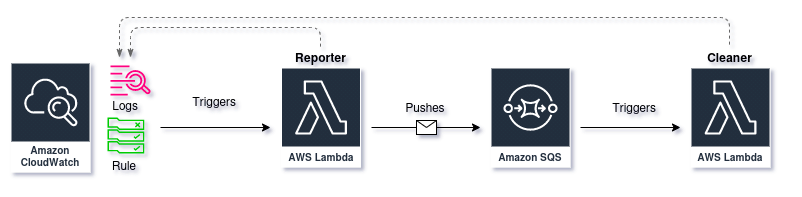

# AWS Security Group Cleaner


## Abstract
This solution seeks to clean up different rule groups of Firewalls, such as AWS Security Groups.

## ⚙️ Configuration
Configurations are taken from environment variables but they have a default, specified in `app/config.py`, if were never set.
All env variables can be easily set by editing and then sourcing the `.env` file at the root directory of the project.
```sh
source .env
```
## :cloud: Infrastructure  
The infra consists in two AWS Lambdas and a Queue. The first lambda (Reporter) is in charge of reporting unused groups of rules from different sources and the push them into a queue (SQS). Once the queue process the messages, it sends it to the second lambda (Cleaner) that's in charge of deleting that group of rules from the corresponding firewall.


## :rocket: Deploy
[Terraform](http://terraform.io/) was used to define the infrastructure. Resources specification can be found under the `terraform` folder on the root directory of the project.
To deploy the solution, make sure you have **terraform** installed. Then run the following commands inside the `./terraform` folder:
```shell
terraform apply --auto-approve
```
***Note:** Please make sure you have the correct access write to create the resources.*

## :woman_technologist: Development
To set up the environment run the following commands
```shell
python -m venv venv
source venv/bin/activate
pip install -r requirements.txt
```
In order to test the solution, once the infrastructure is deployed, you can skip the CloudWatch trigger and run the first Lambda manually. Since you will be "executing the lambda" locally, bare in mind that you will need the [awscli configured](https://docs.aws.amazon.com/cli/latest/userguide/cli-configure-files.html) with valid credentials and [some permissions](./terraform/policies/sg_reporter_inline_policy.json) to do so.

To execute the lambda, please run the following commands:
```
python reporter/main.py
```
Trying the second Lambda `python cleaner/main.py` will result in an exception since it depende on an event. I suggest trying this last directly on the cloud.


## Testing

Tests run separately for `reporter` and `cleaner` and rely on [Pytest](https://docs.pytest.org/en/stable/). To test any changes, once in the desire module (eg. `cd reporter`), simply run:

```
python -m pytest --cov
```
